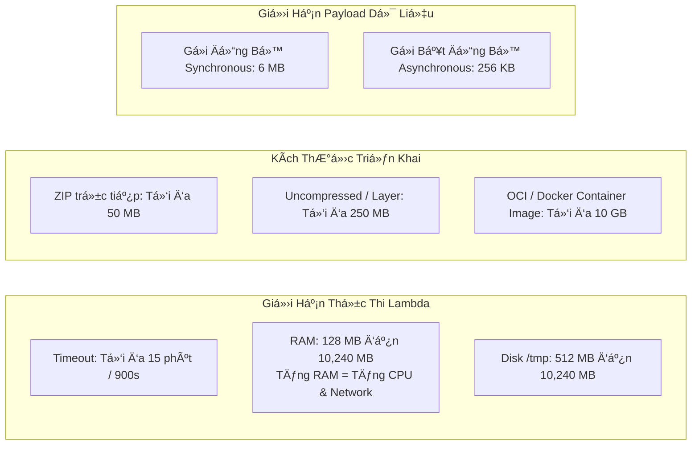
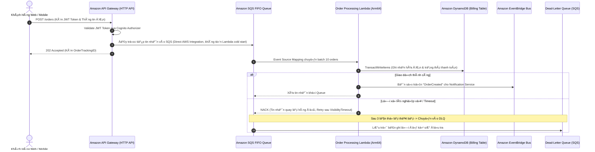

# Tài Liệu Học Tập Chuyên Sâu: AWS Lambda, Amazon API Gateway, DynamoDB & Kiến Trúc Phi Máy Chủ (Serverless Architecture)

> **Tài liệu chuẩn hóa kiến trúc đám mây**: Hướng dẫn toàn diện theo tiêu chuẩn Senior AWS Solutions Architect & Cloud DevOps Engineer (cập nhật mới nhất 2026).  
> **Ngôn ngữ**: Tiếng Việt (Bảo lưu toàn bộ thuật ngữ chuyên ngành tiếng Anh chuẩn AWS).  
> **Các dịch vụ liên quan**: AWS Lambda, Amazon API Gateway, Amazon DynamoDB, AWS Step Functions, Amazon Cognito, Amazon EventBridge.

---

## 1. Tổng Quan Dịch Vụ (Service Overview)

### Dịch vụ gì?
Mô hình điện toán phi máy chủ (**Serverless**) trên AWS cho phép lập trình viên và kiến trúc sư đám mây xây dựng và vận hành các ứng dụng hoàn chỉnh mà không cần cấu hình, bảo trì hay quản lý bất kỳ cụm máy ảo nào. Bộ tứ trụ cột Serverless cốt lõi bao gồm:
1. **AWS Lambda**: Dịch vụ tính toán phi máy chủ (Function-as-a-Service - FaaS), thực thi mã nguồn để phản hồi lại các sự kiện (Events), tự động co giãn từ 0 đến hàng chục ngàn lượt thực thi đồng thời và chỉ tính phí chính xác theo từng millisecond thực thi mã (GB-seconds).
2. **Amazon API Gateway**: Cổng kết nối API được quản lý toàn diện cho phép tạo, xuất bản, bảo mật, đo lường và giám sát các REST API, HTTP API và WebSocket API ở bất kỳ quy mô nào.
3. **Amazon DynamoDB**: Cơ sở dữ liệu NoSQL dạng Key-Value và Document hoàn toàn phi máy chủ, cung cấp độ trễ phản hồi dưới 10 millisecond (**Single-digit millisecond latency**) ở bất kỳ quy mô lưu trữ và thông lượng nào.
4. **AWS Step Functions**: Dịch vụ điều phối quy trình phân tán (Visual Workflow Orchestration) sử dụng máy trạng thái (State Machines) để kết nối các microservices, xử lý luồng rẽ nhánh và rollback giao dịch (Saga Pattern).
5. **Amazon Cognito**: Dịch vụ quản lý danh tính người dùng ứng dụng di động/web, hỗ trợ đăng nhập, đăng ký và cấp quyền truy cập tài nguyên AWS an toàn.

---

## 2. Các Khái Niệm, Kiến Trúc & Vận Hành Cốt Lõi (Core Concepts, Security & Day-2 Operations)

### 1. Giới Hạn Kỹ Thuật Sống Còn của AWS Lambda (Lambda Limits & Runtime)

```mermaid
flowchart LR
    subgraph ExecutionLimits[Giới Hạn Thực Thi Lambda]
        T[Timeout: Tối đa 15 phút / 900s]
        M[RAM: 128 MB đến 10,240 MB\nTăng RAM = Tăng CPU & Network]
        D[Disk /tmp: 512 MB đến 10,240 MB]
    end

    subgraph PackagingLimits[Kích Thước Triển Khai]
        Z[ZIP trực tiếp: Tối đa 50 MB]
        U[Uncompressed / Layer: Tối đa 250 MB]
        C[OCI / Docker Container Image: Tối đa 10 GB]
    end

    subgraph PayloadLimits[Giới Hạn Payload Dữ Liệu]
        Sync[Gọi Đồng Bộ Synchronous: 6 MB]
        Async[Gọi Bất Đồng Bộ Asynchronous: 256 KB]
    end
```

- **Thời gian thực thi tối đa (Execution Timeout)**: **Tối đa 15 phút (900 giây)** cho một lần gọi. Không dùng Lambda cho các tác vụ phân tích batch kéo dài hàng giờ (chuyển sang AWS Fargate hoặc AWS Batch).
- **Cấp phát bộ nhớ RAM**: Từ **128 MB đến 10 GB**. Khi tăng RAM, AWS tự động tăng tuyến tính sức mạnh vCPU (tại 1,769 MB RAM, Lambda được cấp chính xác 1 vCPU đầy đủ).
- **Ổ đĩa tạm thời (`/tmp`)**: Khởi tạo từ 512 MB lên tới 10 GB, có thể dùng để giải nén model AI hoặc cache dữ liệu lớn trong cùng một môi trường thực thi.
- **Payload Limits**: 6 MB cho gọi đồng bộ (qua API Gateway / SDK invoke) và 256 KB cho gọi bất đồng bộ (qua SNS / S3 / EventBridge).

---

### 2. Quản Trị Concurrency, Cold Start & SnapStart

- **Cold Start (Khởi động lạnh)**: Khi có request mới mà chưa có môi trường thực thi nào sẵn sàng, Lambda phải tải code, khởi động container runtime, và chạy đoạn mã khởi tạo bên ngoài handler (`init code`). Gây độ trễ từ vài trăm ms đến vài giây (đặc biệt với ứng dụng Java/.NET và container image) (`TD-Set8 Q09`).
- **Reserved Concurrency**: 
  - Cố định số lượng thực thi đồng thời tối đa dành riêng cho một hàm từ pool tài khoản (ví dụ: gán 200 execution slots) (`TD-Set1 Q39`).
  - **Mục đích kép sống còn**:
    1. Đảm bảo hàm quan trọng luôn có đủ tài nguyên thực thi, không bị các hàm khác trong tài khoản chiếm đoạt (ngăn ngừa cạn kiệt pool 1,000 unreserved concurrency của Region).
    2. Đóng vai trò làm trần giới hạn thông lượng tối đa nhằm **bảo vệ cơ sở dữ liệu hạ nguồn (RDS / Aurora)** khỏi bị sập do cạn kiệt connection pool khi traffic tăng đột biến (`TD-Set1 Q39`).
- **Provisioned Concurrency**:
  - Khởi tạo và "làm ấm" sẵn một số lượng môi trường thực thi cố định 24/7.
  - **Triệt tiêu hoàn toàn độ trễ Cold Start**, đảm bảo thời gian phản hồi ở mức 2 chữ số millisecond cho các workload nhạy cảm về độ trễ (như API tài chính, giao dịch chứng khoán, hoặc containerized Java microservices) (`TD-Set1 Q39`, `TD-Set8 Q09`).
- **Lambda SnapStart (cho Java 11/17/21)**: Chụp snapshot toàn bộ trạng thái bộ nhớ MicroVM sau khi hoàn tất init và cache lại; khi có request, Lambda khôi phục tức thời từ snapshot, giảm độ trễ khởi động tới **90%** mà không mất thêm chi phí duy trì.
- **Lambda Function URLs**:
  - Cung cấp một điểm cuối HTTPS chuyên dụng (Dedicated HTTPS Endpoint) trỏ trực tiếp vào hàm Lambda mà **KHÔNG CẦN tạo Amazon API Gateway hay Application Load Balancer** (`TD-Set2 Q56`, `TD-Set6 Q43`).
  - Hỗ trợ loại xác thực `AWS_IAM` (bảo vệ nội bộ) hoặc `NONE` (công khai internet) kết hợp CORS. Rất tối ưu chi phí và tinh gọn cho các kịch bản tiếp nhận **Webhook từ bên thứ ba** (như GitHub, Stripe, hoặc dịch vụ y tế gửi JSON payload) (`TD-Set6 Q43`).
- **Mã Hóa Biến Môi Trường (Environment Variables) Bằng KMS**:
  - Mặc định AWS Lambda mã hóa biến môi trường bằng AWS managed key (`aws/lambda`).
  - Khi doanh nghiệp yêu cầu kiểm soát toàn diện vòng đời khóa, chính sách truy cập hoặc khả năng thu hồi key ngay lập tức, bắt buộc kích hoạt **Lambda Encryption Helpers** và sử dụng **AWS KMS Customer Managed Key (CMK)** để mã hóa các chuỗi kết nối và mật khẩu nhạy cảm (`TD-Set1 Q58`).
- **Lambda Asynchronous Destinations**:
  - Định tuyến tự động kết quả thực thi của các tác vụ bất đồng bộ mà không cần viết mã trong hàm: gửi bản ghi thành công tới **On-Success Destination** hoặc gửi chi tiết lỗi tới **On-Failure Destination** (đích đến hỗ trợ: Amazon SQS, Amazon SNS, Amazon EventBridge, hoặc một Lambda function khác) (`TD-Set2 Q09`).
- **Response Streaming**: Cho phép hàm Lambda truyền luồng phản hồi dữ liệu về client theo từng phần (Chunked Transfer) mà không cần đợi toàn bộ payload hoàn tất, giúp giảm Time-to-First-Byte (TTFB) và vượt giới hạn payload 6 MB (lên tới 20 MB).

---

### 3. Mô Hình Kích Hoạt Lambda: Sync vs Async vs Event Source Mapping

```mermaid
flowchart TD
    subgraph SyncModel[1. Synchronous Invocation]
        APIGW[API Gateway / ALB] -->|Chờ kết quả trả về ngay| L1[AWS Lambda]
        L1 -->|Return Payload / Error| APIGW
    end

    subgraph AsyncModel[2. Asynchronous Invocation]
        S3[S3 / SNS / EventBridge] -->|HTTP 202 Accepted| Queue[(Internal Lambda Queue)]
        Queue --> L2[AWS Lambda]
        L2 -.->|Retry 2 lần thất bại| DLQ[(Dead-Letter Queue SQS / SNS / Destination)]
    end

    subgraph ESMModel[3. Event Source Mapping Polling]
        Streams[(DynamoDB Streams / Kinesis / SQS)] -->|Lambda Service tá»± Ä‘á»™ng Poll| ESM[Event Source Mapping]
        ESM -->|Batching Records| L3[AWS Lambda]
    end
```

---

### 4. Tích Hợp Amazon API Gateway Với AWS Lambda
- **Mô hình Proxy Tích hợp (Lambda Proxy Integration)**: API Gateway tiếp nhận HTTP requests, đóng gói toàn bộ HTTP headers, query parameters, body thành một JSON payload duy nhất truyền vào `event` của hàm Lambda.
- **Lựa chọn loại API Gateway**:
  - **HTTP APIs**: Chi phí siêu rẻ (\$1.00/1M calls), độ trễ cực thấp (< 10ms), native OIDC/JWT Authorizer $\rightarrow$ Khuyến nghị mặc định cho Serverless Microservices.
  - **REST APIs**: Hỗ trợ API Caching, WAF, Usage Plans, API Keys, Request Validation $\rightarrow$ Dành cho Enterprise B2B APIs.
  - **WebSocket APIs**: Kết nối hai chiều bền bỉ (Stateful) cho Chat, Real-time Dashboard (`U-PT1 Q17`).
- 📖 *Xem phân tích chuyên sâu tại:* [Tài Liệu Chuyên Sâu: Amazon API Gateway, Cognito & Step Functions](./APIGateway_Cognito_StepFunctions.md)

---

### 5. Tích Hợp Amazon DynamoDB & Luồng Dữ Liệu Với AWS Lambda
- **Event Source Mapping vá»›i DynamoDB Streams**:
  - Ghi nhận mọi sự kiện thay đổi dữ liệu (`INSERT`, `MODIFY`, `REMOVE`) theo thời gian thực và tự động kích hoạt Lambda để xử lý hậu kỳ (Auditing, Cache invalidation, Notification).
  - Sử dụng tham số `BisectBatchOnFunctionError: true` kết hợp On-Failure Destination để tự động cô lập bản ghi lỗi (Poison Pill) mà không làm tắc nghẽn luồng Stream (`TD-Set3 Q18`, `CM-PT1 Q50`).
- 📖 *Xem phân tích chi tiết thiết kế bảng, phân vùng và DAX tại:* [Tài Liệu Chuyên Sâu: Amazon DynamoDB & NoSQL Databases](./DynamoDB_NoSQL_Databases.md)

---

### 6. Kiến Trúc Mạng Lambda Trong VPC (Lambda VPC Networking & Hyperplane ENI)

```mermaid
flowchart TD
    subgraph VPC["Amazon VPC (10.0.0.0/16)"]
        subgraph PrivateSubnet["Private Subnet (10.0.1.0/24)"]
            HENI["AWS Hyperplane ENI\n(Được cấp phát và dùng chung cho Lambda SG)"]
            RDS[(Amazon RDS / Aurora\nSecurity Group: Allow 3306/5432 from Lambda SG)]
        end

        subgraph PublicSubnet["Public Subnet (10.0.0.0/24)"]
            NAT[NAT Gateway\nElastic IP gán kèm]
            IGW[Internet Gateway]
            NAT --> IGW
        end

        subgraph Endpoints["VPC Endpoints (PrivateLink)"]
            GW_S3[Gateway VPC Endpoint -> S3 / DynamoDB\n(Miễn phí, gán vào Route Table)]
            IF_SQS[Interface VPC Endpoint -> SQS / Secrets Manager\n(ENI có phí, gắn Private IP)]
        end

        HENI --> RDS
        HENI -.->|0.0.0.0/0 qua Route Table| NAT
        HENI -.-> GW_S3
        HENI -.-> IF_SQS
    end

    LambdaWorker["AWS Lambda Execution Fleet\n(Nằm trong VPC do AWS quản lý)"] -->|Tạo tunnel qua Hyperplane| HENI
    IGW --> Internet((Public Internet / External APIs))
```

* **Cơ chế Hyperplane ENI (AWS Managed Cross-Account ENI)**:
  - Trước 2019, mỗi Lambda instance gắn vào VPC phải tự tạo 1 Elastic Network Interface (ENI) riêng, gây độ trễ Cold Start lên tới 10-30 giây và làm cạn kiệt IP subnet.
  - Từ phiên bản kiến trúc hiện đại, AWS sử dụng **AWS Hyperplane**. Hyperplane cấp phát một số lượng nhỏ ENI dùng chung (**Shared ENIs**) cho mỗi cặp `Subnet + Security Group`. Khi Lambda scale từ 1 lên 1,000 instances, chúng tái sử dụng cùng các Hyperplane ENI này, **triệt tiêu hoàn toàn độ trễ Cold Start do gắn mạng**.
* **3 Quy Tắc Sống Còn Khi Đưa Lambda Vào VPC**:
  1. **Lambda trong VPC KHÔNG BAO GIỜ nhận Public IP**: Kể cả khi bạn đặt Lambda vào một Public Subnet (có route trỏ ra Internet Gateway), Lambda vẫn **KHÔNG THỂ truy cập Internet**. Muốn Lambda ra Internet (gọi bên thứ ba), **bắt buộc phải đặt Lambda vào Private Subnet** và định tuyến `0.0.0.0/0` qua **NAT Gateway** nằm tại Public Subnet (*CM-PT1 Q23, CM-PT2 Q05*).
  2. **Truy cập Database riêng tư (RDS / Aurora)**:
     - Gán Lambda vào các Private Subnets trong cùng VPC với RDS.
     - Cấu hình **Security Group Referencing**: RDS Security Group cho phép Inbound port (MySQL 3306, PostgreSQL 5432) với Source là **ID của Lambda Security Group** (thay vì dải CIDR IP).
  3. **Truy cập dịch vụ AWS mà không cần qua NAT Gateway**:
     - Cấu hình **Gateway VPC Endpoint** cho S3 và DynamoDB (hoàn toàn miễn phí, lưu lượng định tuyến nội bộ AWS backbone).
     - Cấu hình **Interface VPC Endpoint** cho SQS, SNS, Secrets Manager để tiết kiệm chi phí data transfer qua NAT Gateway (*CM-PT2 Q12*).

---

### 7. Khả Năng Chống Chịu Khi Xử Lý Luồng Dữ Liệu (Event Source Mapping Resiliency)

```mermaid
flowchart TD
    Stream[(Kinesis Data Streams / DynamoDB Streams)] -->|Lấy 1 lô 100 bản ghi| ESM[Event Source Mapping]
    ESM --> Lambda[Hàm AWS Lambda]
    Lambda -->|Bản ghi thứ 45 bị lỗi ném Exception| ESM
    
    ESM --> BisectCheck{Bật BisectBatchOnFunctionError?}
    BisectCheck -->|CÓ (Khuyến nghị)| Split["Tự động chia đôi lô dữ liệu thành 2 nửa (50 bản ghi)\nGọi lại Lambda độc lập cho từng nửa"]
    Split --> FindPoison["Cô lập chính xác bản ghi lỗi (Poison Pill)\nGửi bản ghi hỏng vào SQS DLQ / SNS Destination"]
    Split --> ProcessHealthy["99 bản ghi hợp lệ còn lại được xử lý thành công!"]
    
    BisectCheck -->|KHÔNG (Mặc định)| RetryForever["Thử lại toàn bộ lô 100 bản ghi liên tục\n-> GÂY NGHẼN TOÀN BỘ SHARD (Head-of-Line Blocking)!"]
```

* **Vấn đề Head-of-Line Blocking**: Khi xử lý Kinesis hoặc DynamoDB Streams theo thứ tự thời gian (shards), nếu một bản ghi trong lô bị lỗi (`poison pill`), mặc định Lambda sẽ thử lại toàn bộ lô đó cho đến khi hết hạn (Retention Period). Điều này làm tắc nghẽn toàn bộ luồng xử lý của shard.
* **Bộ cấu hình phục hồi chuẩn mực (Stream Resiliency Controls)**:
  1. **`BisectBatchOnFunctionError: true`**: Khi gặp lỗi, tự động chia đôi lô dữ liệu và thử lại từng nửa. Quá trình chia đôi lặp lại cho đến khi cô lập đúng 1 bản ghi lỗi duy nhất (*TD-Set3 Q18*).
  2. **`MaximumRetryAttempts`**: Giới hạn số lần thử lại tối đa (ví dụ: 3 lần) thay vì thử lại vô tận.
  3. **`MaximumRecordAgeInSeconds`**: Bỏ qua các bản ghi đã quá cũ (ví dụ: quá 3,600 giây).
  4. **`On-Failure Destination`**: Tự động chuyển metadata của bản ghi lỗi sang **Amazon SQS** hoặc **Amazon SNS** để kỹ sư phân tích sau, giải phóng shard tiếp tục xử lý (*CM-PT1 Q50*).

---

### 🏛️ I. Các Kịch Bản Kiến Trúc Chuẩn (Best Practice Scenarios)

#### 1. Pipeline Ingestion Serverless Hoàn Toàn: SQS Standard + Lambda + DynamoDB Auto-Scaling
- **Tình huống thi**: Hệ thống IoT nhận telemetry dữ liệu cảm biến xe hơi với lưu lượng thay đổi thất thường. Yêu cầu kiến trúc 100% serverless, không cần cấu hình dung lượng thủ công (no manual capacity provisioning).
- **Giải pháp tối ưu chuẩn AWS**:
  - Dữ liệu cảm biến đẩy vào **Amazon SQS Standard Queue**.
  - **AWS Lambda** tự động poll tin nhắn theo lô (batches) thông qua cơ chế Event Source Mapping (ESM).
  - Lambda ghi dữ liệu vào bảng **Amazon DynamoDB** được cấu hình chế độ **On-Demand Capacity** hoặc **Provisioned Mode kèm Auto-Scaling**.
  - **Lợi ích**: Toàn bộ hệ thống tự động co giãn từ 0 đến hàng ngàn request/s mà không cần can thiệp vận hành.

#### 2. Điều Phối Quy Trình Serverless Phức Tạp Bằng AWS Step Functions (Orchestration vs Choreography)
- **Tình huống thi**: Quy trình xử lý ảnh/video hoặc pipeline Data Lake ETL cần chạy tuần tự nhiều bước, kiểm tra điều kiện, xử lý lỗi (retry/catch), và có các tác vụ batch kéo dài.
- **Giải pháp chuẩn**:
  - Không viết một hàm Lambda "khổng lồ" chứa toàn bộ logic (Anti-pattern).
  - Sử dụng **AWS Step Functions (Standard Workflow)** làm bộ điều phối trạng thái (State Machine):
    - BÆ°á»›c 1: Lambda validate input.
    - Bước 2: Trigger **AWS Glue ETL Job** hoặc **AWS Batch** để xử lý nặng.
    - Bước 3: Đợi tác vụ hoàn tất (sử dụng service integration `.sync`).
    - Bước 4: Gửi thông báo SNS khi thành công hoặc đẩy vào DLQ khi thất bại.

#### 3. Quản Trị Concurrency Bảo Vệ Database Phía Sau (RDS / Aurora)
- **Tình huống thi**: Ứng dụng Serverless gọi vào cơ sở dữ liệu quan hệ (Amazon RDS/Aurora). Khi traffic tăng đột biến, hàng ngàn Lambda instance khởi tạo đồng thời làm cạn kiệt connection pool của Database.
- **Giải pháp chuẩn**:
  - Cấu hình **Reserved Concurrency** trên hàm Lambda (ví dụ: giới hạn tối đa 50 concurrent executions) để tạo trần chặn quá tải database.
  - Kết hợp sử dụng **Amazon RDS Proxy**: Quản lý connection pool tập trung, chia sẻ kết nối giữa các hàm Lambda, giảm thiểu 90% chi phí mở kết nối mới.

---

### 🪤 II. Các Bẫy Thi Tinh Vi & Phân Tích Phương Án Sai (Exam Traps & Distractors)

#### 🪤 Bẫy 1: Giới Hạn Thời Gian 15 Phút Của Lambda (Execution Timeout) — (U-PT2 Q02)
- **Tình huống đề thi**: *"Doanh nghiệp có một script phân tích dữ liệu cần chạy định kỳ mỗi đêm, thời gian thực thi mất từ 25 đến 30 phút. Giải pháp Serverless nào tối ưu và tốn ít công quản trị nhất?"*
- **Các phương án bẫy**:
  - ❌ *Dùng AWS Lambda*: Giới hạn cứng bất biến của Lambda là **tối đa 15 phút (900 giây)**. Bất kỳ tác vụ nào vượt quá 15 phút đều bị Lambda hủy bỏ bắt buộc (Force Kill). Không thể cấu hình timeout lớn hơn 15m.
  - ❌ *Chia nhỏ hàm Lambda thành nhiều hàm lồng nhau*: Gây phức tạp mã nguồn và khó bảo trì không cần thiết.
- **Giải pháp ĐÚNG**: Sử dụng **Amazon ECS Task chạy trên AWS Fargate**, được lập lịch kích hoạt bởi **Amazon EventBridge Scheduler**.
  - AWS Fargate là serverless container (không cần quản lý máy chủ EC2).
  - Không có giới hạn thời gian chạy (có thể chạy bao lâu tùy ý).

#### 🪤 Bẫy 2: Tái Sử Dụng Mã Nguồn & Thư Viện Giữa Nhiều Lambda (Lambda Layers) — (CM-PT1 Q17)
- **Tình huống đề thi**: *"Đội ngũ phát triển xây dựng nhiều microservices bằng AWS Lambda. Có một bộ thư viện tiện ích (common utilities/logging) cần được dùng chung giữa tất cả các hàm và phải cập nhật phiên bản dễ dàng với chi phí vận hành thấp nhất."*
- **Các phương án bẫy**:
  - ❌ *Đóng gói thư viện vào từng file ZIP của mỗi hàm*: Mỗi lần sửa 1 dòng code tiện ích phải build và redeploy toàn bộ hàng chục hàm Lambda.
  - ❌ *Lưu file code trên S3 và cho Lambda tải về khi chạy*: Tăng đáng kể độ trễ Cold Start và chi phí request S3.
  - ❌ *Chuyển toàn bộ sang Container Image*: Tăng kích thước package và overhead quy trình CI/CD.
- **Giải pháp ĐÚNG**: Đóng gói thư viện vào **AWS Lambda Layers**.
  - Một Layer có thể được chia sẻ giữa nhiều Lambda functions trong cùng tài khoản hoặc xuyên tài khoản.
  - Hỗ trợ đánh số phiên bản (Versioning) rõ ràng. Mỗi hàm Lambda có thể gắn tối đa 5 Layers.

#### 🪤 Bẫy 3: Trùng Lặp Định Danh Ngẫu Nhiên (UUID) Trong Lambda SnapStart — (CM-PT1 Q27)
- **Tình huống đề thi**: *"Ứng dụng Java sử dụng AWS Lambda SnapStart để tối ưu Cold Start. Sau khi triển khai, hệ thống phát hiện các mã giao dịch ngẫu nhiên (UUID) tạo ra từ các execution environments khác nhau bị trùng lặp nhau hoàn toàn."*
- **Nguyên nhân cốt lõi**:
  - SnapStart khởi động container, thực thi toàn bộ giai đoạn `Init`, sau đó chụp snapshot bộ nhớ RAM và lưu trữ.
  - Nếu mã nguồn sinh UUID hoặc thiết lập random seed ngay trong giai đoạn `Init` tĩnh trước snapshot, trạng thái bộ nhớ đó sẽ được giữ nguyên cho mọi instance khôi phục sau này -> **toàn bộ các instance mới đều mang cùng 1 giá trị ID**!
- **Giải pháp ĐÚNG**: Sử dụng **CRaC (Coordinated Restore at Checkpoint) API**:
  - Gọi `org.crac.Core.getGlobalContext().register(resource)` để đăng ký **pre-snapshot hook** hoặc **post-restore hook**.
  - Đảm bảo các giá trị ngẫu nhiên, UUID, hoặc kết nối mạng được tạo mới lại tại thời điểm runtime sau khi restore.

#### 🪤 Bẫy 4: Phân Biệt Tuyệt Đối Cognito User Pools vs Cognito Identity Pools — (U-PT6 Q39, U-PT2 Q14)
- **Bẫy thi kinh điển**: Đề thi thường yêu cầu người dùng ứng dụng di động tải file trực tiếp lên S3 hoặc đăng nhập vào Web. Thí sinh rất dễ nhầm lẫn giữa User Pool và Identity Pool.

| Tiêu chuẩn so sánh | Amazon Cognito User Pool | Amazon Cognito Identity Pool (Federated Identities) |
|:---|:---|:---|
| **Mục đích chính** | **Xác thực danh tính (Authentication)** | **Cấp quyền truy cập tài nguyên AWS (Authorization)** |
| **Đầu ra (Output)** | Trả về các **JWT Tokens** (ID Token, Access Token, Refresh Token) | Trả về **AWS Temporary Credentials** (Access Key, Secret Key, Session Token) |
| **Cấp quyền AWS** | ❌ **KHÔNG** cấp quyền truy cập tài nguyên AWS trực tiếp | ✅ **Gán IAM Role** cho user để gọi thẳng API AWS (S3, DynamoDB) |
| **Tích hợp ALB** | ✅ **ALB hỗ trợ native** xác thực người dùng qua User Pool listener rules | ❌ Không gắn trực tiếp vào ALB listener rules |
| **Đăng nhập xã hội** | Hỗ trợ Sign-in with Apple, Google, Facebook, SAML, OIDC | Nhận token từ User Pool hoặc Google/Facebook để đổi lấy IAM Role |

- **Quy tắc thi cử**:
  - Người dùng đăng nhập web qua ALB -> **Cognito User Pool**.
  - App di động cần upload trực tiếp lên S3 bucket riêng của user -> **Cognito User Pool (đăng nhập) + Cognito Identity Pool (lấy quyền IAM Role ghi vào S3)**.

#### 🪤 Bẫy 5: Nghẽn Lưu Lượng Khi SNS Gửi Tin Tới Lambda (SNS-to-Lambda Delivery Bottlenecks) — (U-PT1 Q34)
- **Tình huống đề thi**: *"Amazon SNS fan-out tin nhắn tới hàng ngàn subscribers, trong đó có một hàm AWS Lambda. Đội ngũ phát hiện một lượng lớn tin nhắn bị chậm trễ hoặc thất bại khi invoke Lambda."*
- **Nguyên nhân & Khắc phục**:
  - Khi SNS invoke Lambda (theo mô hình Asynchronous), số lượng concurrency của Lambda tăng vọt. Nếu tài khoản đạt ngưỡng giới hạn **Account Concurrency Limit** (mặc định 1,000 unreserved concurrency/Region), các yêu cầu invoke tiếp theo sẽ bị throttle.
  - **Giải pháp**: Yêu cầu AWS Support tăng **Account Concurrency Quota** hoặc cấu hình SQS làm buffer đệm giữa SNS và Lambda.

#### 🪤 Bẫy 6: Gọi Hàm Lambda Xuyên Tài Khoản Từ Amazon SNS — (CM-PT1 Q61)
- **Tình huống đề thi**: *"Hệ thống sử dụng Amazon SNS Topic tại Tài khoản AWS A để thông báo sự kiện. Cần gọi thực thi một hàm AWS Lambda tại Tài khoản AWS B mỗi khi có thông báo mới. Cấu hình phân quyền nào bắt buộc phải có?"*
- **Quy tắc bắt buộc phải có 2 chính sách đồng thời**:
  1. **Lambda Resource-Based Policy tại Tài khoản B**: Bắt buộc thêm một permission statement cho phép Principal `sns.amazonaws.com` thực hiện Action `lambda:InvokeFunction` với điều kiện `SourceArn` trỏ chính xác vào ARN của SNS Topic ở Tài khoản A.
  2. **SNS Topic Policy tại Tài khoản A**: Bắt buộc cho phép Tài khoản B hoặc Lambda function quyền `sns:Subscribe` vào Topic này.
- **Bẫy đề thi**: Chỉ cấu hình 1 trong 2 phía (ví dụ chỉ tạo IAM Role gán vào Lambda hoặc chỉ sửa topic policy) $\rightarrow$ Thao tác subscribe hoặc invoke sẽ bị từ chối truy cập ngay lập tức!

#### 🪤 Bẫy 7: Xử Lý Đợt Tải Tăng Đột Biến Bằng SQS Đệm Trước Lambda — (CM-PT1 Q35, CM-PT5 Q08)
- **Tình huống đề thi**: *"Website tin tức tiếp nhận lượng lớn bài viết gửi về đồng thời trong các sự kiện thể thao lớn. Nếu gửi trực tiếp tới cụm xử lý backend sẽ gây quá tải sập cơ sở dữ liệu. Cần giải pháp phân rã kiến trúc với chi phí thấp nhất."*
- **Giải pháp ĐÚNG**:
  - Sử dụng hàm **AWS Lambda Ingestion** tiếp nhận bài viết và đẩy vào hàng đợi **Amazon SQS Standard**.
  - Một nhóm worker Lambda khác cấu hình **SQS Event Source Mapping** với Batch Size phù hợp để lấy tin nhắn ra xử lý tuần tự/song song có kiểm soát.
  - SQS hoạt động như một hồ chứa đệm (Buffer leveling), triệt tiêu hoàn toàn nguy cơ quá tải backend.

#### 🪤 Bẫy 8: Điều Phối Luồng Xử Lý Serverless Phức Tạp Bằng AWS Step Functions — (CM-PT1 Q06, CM-PT1 Q38)
- **Tình huống đề thi**: *"Quy trình xử lý ảnh và trích xuất dữ liệu ETL serverless bao gồm nhiều bước: kiểm tra định dạng ảnh, gọi AWS Batch để resize nhiều kích cỡ, gọi AWS Glue để trích xuất text, và lưu kết quả vào S3. Các bước có logic rẽ nhánh điều kiện và cần tự động thử lại khi gặp lỗi mạng."*
- **Giải pháp ĐÚNG**: Sử dụng **AWS Step Functions (State Machines)** (`CM-PT1 Q06`, `CM-PT1 Q38`).
  - Step Functions cung cấp giao diện trực quan hóa trạng thái thực thi.
  - Tự động hóa việc xử lý lỗi (Catch & Retry với Exponential Backoff), kiểm soát timeout từng bước và hỗ trợ cả luồng công việc chạy dài hạn (lên tới 1 năm). Loại bỏ hoàn toàn việc viết code spaghetti Lambda gọi lồng nhau!

#### 🪤 Bẫy 9: Ngăn Ngừa Cạn Kiệt Concurrency & Bảo Vệ Database Bằng Reserved Concurrency — (CM-PT2 Q59)
- **Tình huống đề thi**: *"Một ứng dụng thương mại điện tử trải qua sự kiện bùng nổ flash sale. Hàng ngàn request đổ dồn vào một hàm Lambda kết nối trực tiếp với Amazon RDS MySQL. Cơ sở dữ liệu bị cạn kiệt connection pool dẫn đến sập toàn bộ hệ thống. Cần giải pháp gì ở tầng Lambda để giới hạn số lượng kết nối tối đa?"*
- **Các phương án bẫy**:
  - ❌ *Tăng RAM cho Lambda lên 10 GB*: Tăng RAM chỉ tăng CPU, càng khiến Lambda tạo nhiều kết nối dồn dập vào database nhanh hơn!
  - ❌ *Tăng Provisioned Concurrency*: Càng làm sẵn nhiều execution environments làm DB quá tải tức thì.
- **Giải pháp ĐÚNG**: Cấu hình **Reserved Concurrency** cho hàm Lambda (ví dụ: đặt mức 50 hoặc 100) (`CM-PT2 Q59`).
  - Reserved Concurrency áp đặt một "trần cứng" (Hard Limit) về số lượng thực thi đồng thời tối đa của hàm. Mọi request vượt quá sẽ bị throttle tạm thời (kết hợp với Amazon SQS đệm phía trước hoặc RDS Proxy), bảo vệ tuyệt đối database không bị chết kết nối.

#### 🪤 Bẫy 10: Xóa Bỏ Độ Trễ Cold Start: AWS Lambda SnapStart vs Provisioned Concurrency — (TD-Set8 Q09, CM-PT5 Q63, CM-PT4 Q18, U-PT3 Q43)
- **Tình huống đề thi**: *"Doanh nghiệp chuyển đổi một ứng dụng microservices viết bằng Java lên AWS Lambda. Hệ thống yêu cầu thời gian phản hồi API phải nhất quán và dưới 50ms cho các giao dịch tài chính quan trọng. Tuy nhiên các request đầu tiên thường bị trễ vài giây do Cold Start nạp JVM. Cần giải pháp xử lý tối ưu nhất?"*
- **Quy tắc phân biệt 2 giải pháp Cold Start sống còn**:
  1. **Khi đề bài là ứng dụng Java & yêu cầu chi phí tối ưu nhất (hoặc giải pháp miễn phí)** $\rightarrow$ Chọn **AWS Lambda SnapStart** (`TD-Set8 Q09`, `CM-PT5 Q63`).
     - SnapStart nạp JVM và thực thi toàn bộ code khởi tạo, sau đó chụp một snapshot microVM lưu vào bộ nhớ cache đa tầng. Khi có invocation mới, Lambda khôi phục từ snapshot chỉ mất dưới 200ms.
     - Tính năng này **hoàn toàn MIỄN PHÍ**, không phát sinh chi phí duy trì 24/7!
     - *Lưu ý an ninh*: Cần dùng **CRaC (Coordinated Restore at Checkpoint) Pre-Snapshot Hook** để tránh trùng lặp các giá trị ngẫu nhiên hoặc UUID khởi tạo trước snapshot (`CM-PT1 Q27`).
  2. **Khi đề bài dùng ngôn ngữ khác (Python, Node.js, Go, Container Images) hoặc đề bài không có phương án SnapStart** $\rightarrow$ Chọn **Provisioned Concurrency** (`CM-PT4 Q18`, `U-PT3 Q43`).
     - AWS duy trì sẵn một số lượng execution environments ấm 24/7.
     - Có tính phí duy trì concurrency theo giờ (\$0.015 / GB-giờ) kể cả khi không có traffic.

#### 🪤 Bẫy 11: Tích Hợp Webhook Bên Thứ Ba Chi Phí Thấp Bằng Lambda Function URLs — (TD-Set2 Q56, TD-Set6 Q43)
- **Tình huống đề thi**: *"Một công ty y tế cần tích hợp một dịch vụ phân tích dữ liệu bên thứ ba. Mỗi khi có dữ liệu bệnh nhân mới, bên thứ ba sẽ gửi HTTP POST request vào một Webhook trên AWS. Yêu cầu triển khai endpoint tiếp nhận request này để gọi hàm Lambda với CHI PHÍ VẬN HÀNH VÀ HẠ TẦNG THẤP NHẤT (LEAST operational overhead & cost)."*
- **Các phương án bẫy**:
  - ❌ *Tạo một Application Load Balancer (ALB) chuyển tiếp tới Lambda*: ALB phát sinh chi phí cố định tối thiểu ~\$16-20/tháng và tốn công cấu hình VPC/Subnet.
  - ❌ *Dựng Amazon API Gateway REST API*: Hoạt động được nhưng phát sinh thêm một tầng dịch vụ và chi phí API Gateway không cần thiết cho một webhook đơn giản.
- **Giải pháp ĐÚNG**: Cấu hình **Lambda Function URL** với `AuthType: NONE` (kèm xác thực token/HMAC bên trong code) (`TD-Set2 Q56`, `TD-Set6 Q43`).
  - Cung cấp trực tiếp một URL HTTPS bảo mật cho hàm Lambda.
  - Hoàn toàn miễn phí hạ tầng trung gian (chỉ trả tiền thực thi Lambda), thiết lập nhanh chóng chỉ trong vài giây.

#### 🪤 Bẫy 12: Bảo Mật Biến Môi Trường Lambda Bằng KMS Customer Managed Key — (TD-Set1 Q58)
- **Tình huống đề thi**: *"Hàm AWS Lambda cần lưu trữ các chuỗi kết nối và thông tin bí mật kết nối tới MongoDB Atlas hoặc database bên ngoài. Quy định an ninh của công ty yêu cầu toàn bộ dữ liệu bí mật phải được mã hóa tại chỗ (at-rest) bằng khóa mã hóa do công ty tự quản lý và có thể thu hồi quyền bất cứ lúc nào."*
- **Các phương án bẫy**:
  - ❌ *Sử dụng AWS managed key mặc định của Lambda (`aws/lambda`)*: Không đáp ứng yêu cầu vì khách hàng không thể chỉnh sửa policy, không thể xoay vòng thủ công hay thu hồi key.
- **Giải pháp ĐÚNG**: Sử dụng **AWS KMS Customer Managed Key (CMK)** kết hợp **Lambda Encryption Helpers** (`TD-Set1 Q58`).
  - Quản trị viên cấu hình mã hóa biến môi trường bằng KMS CMK riêng.
  - Mã nguồn Lambda gọi AWS KMS API để giải mã biến môi trường trong runtime và phân quyền chi tiết qua KMS Key Policy.

#### 🪤 Bẫy 13: Lambda Trong VPC Truy Cập Database Nội Bộ và Đi Ra Internet — (CM-PT1 Q23, CM-PT2 Q05, CM-PT2 Q12)
- **Tình huống đề thi**: *"Hàm AWS Lambda cần truy vấn dữ liệu từ cơ sở dữ liệu Amazon RDS PostgreSQL nằm trong Private Subnet của VPC, đồng thời phải gọi một REST API thanh toán của bên thứ ba nằm ngoài môi trường Internet công cộng. Cấu hình mạng nào là ĐÚNG?"*
- **Các phương án bẫy**:
  - ❌ *Gán Lambda vào Public Subnet có Internet Gateway*: Sai nghiêm trọng! Khi Lambda được gán vào VPC, nó không bao giờ được cấp Public IP. Ngay cả khi nằm trong Public Subnet, nó hoàn toàn KHÔNG THỂ giao tiếp với Internet qua Internet Gateway (IGW đòi hỏi tài nguyên phải có Public IP).
  - ❌ *Cấu hình Security Group của RDS cho phép 0.0.0.0/0*: Sai về bảo mật tối thiểu (Least Privilege) và làm lộ cổng cơ sở dữ liệu.
- **Giải pháp ĐÚNG**:
  - Gán hàm Lambda vào **Private Subnets** có route `0.0.0.0/0` trỏ tới **NAT Gateway** (NAT Gateway đặt ở Public Subnet kèm Elastic IP).
  - Cấu hình Security Group của RDS cho phép Inbound port 5432 với Source là **Security Group ID của hàm Lambda**.
  - Nếu Lambda gọi thêm S3 hoặc DynamoDB, tạo thêm **Gateway VPC Endpoints** gắn vào Route Table của Private Subnet để không tốn cước NAT Gateway.

#### 🪤 Bẫy 14: Xử Lý Lỗi Tắc Nghẽn Luồng Stream Bằng BisectBatchOnFunctionError — (TD-Set3 Q18, CM-PT1 Q50)
- **Tình huống đề thi**: *"Hàm AWS Lambda đọc các lô bản ghi từ Amazon Kinesis Data Streams. Thỉnh thoảng có một vài bản ghi bị định dạng sai (malformed payload - poison pill) làm hàm ném ra exception. Mặc định Lambda thử lại liên tục làm toàn bộ quá trình xử lý của Shard bị tắc nghẽn hoàn toàn. Giải pháp nào giải quyết vấn đề mà ít tốn công tùy biến code nhất?"*
- **Các phương án bẫy**:
  - ❌ *Tăng shard count của Kinesis*: Không giải quyết được bản ghi hỏng nằm trong shard hiện tại.
  - ❌ *Tăng timeout và RAM của hàm Lambda*: Vô ích vì bản ghi bị hỏng logic, tăng tài nguyên vẫn ném Exception.
- **Giải pháp ĐÚNG**: Bật tính năng **`BisectBatchOnFunctionError: true`** kết hợp **`On-Failure Destination` (trỏ tới Amazon SQS DLQ)** trên cấu hình Event Source Mapping.
  - Lambda sẽ tự động chia đôi lô dữ liệu mỗi khi gặp lỗi và gọi lại từng nửa cho đến khi tách riêng được đúng bản ghi hỏng.
  - Bản ghi hỏng được đẩy sang SQS DLQ để phân tích sau, còn 99% các bản ghi hợp lệ khác tiếp tục được xử lý mượt mà.

#### 🪤 Bẫy 15: WebSocket APIs Cho Ứng Dụng Hai Chiều Real-Time (Stateful) vs REST/HTTP APIs — (U-PT1 Q17, U-PT3 Q09)
- **Tình huống đề thi**: *"Doanh nghiệp xây dựng một ứng dụng bảng giá chứng khoán trực tiếp hoặc ứng dụng chat trực tuyến đa người dùng. Hệ thống backend cần chủ động đẩy (push) dữ liệu cập nhật tức thì về cho trình duyệt máy khách mà máy khách không cần phải liên tục gửi request thăm dò (polling). Loại API Gateway nào phù hợp nhất?"*
- **Các phương án bẫy**:
  - ❌ *Sử dụng API Gateway REST API hoặc HTTP API*: REST và HTTP APIs hoạt động theo mô hình Request-Response một chiều không trạng thái (Stateless). Máy chủ không thể chủ động khởi tạo việc gửi dữ liệu tới máy khách nếu máy khách không gửi request lên trước.
- **Giải pháp ĐÚNG**: Sử dụng **Amazon API Gateway WebSocket API**.
  - Duy trì kết nối hai chiều có trạng thái (**Stateful 2-way persistent connection**) giữa máy khách và API Gateway.
  - Cho phép backend đẩy tin nhắn về client bất kỳ lúc nào với độ trễ tính bằng mili-giây qua các route: `$connect`, `$disconnect`, `$default`.

#### 🪤 Bẫy 16: Triển Khai Container Image Trên Lambda (Tối Đa 10 GB) & Dung Lượng Ổ Tạm `/tmp` (512 MB – 10 GB) — (TD-Set3 Q11)
- **Tình huống đề thi**: *"Nhóm kỹ sư cần triển khai mô hình Machine Learning xử lý ảnh trên AWS Lambda. Kích thước mã nguồn, thư viện PyTorch và các tệp trọng số nhị phân lên tới 4.5 GB, vượt xa giới hạn 250 MB giải nén của file ZIP. Ngoài ra, hàm cần lưu tạm các video phân tích 3 GB trong quá trình chạy. Giải pháp nào đáp ứng?"*
- **Giải pháp ĐÚNG**:
  - Đóng gói mã nguồn và dependencies thành **Container Image (định dạng OCI)** với dung lượng tối đa **10 GB** đẩy lên **Amazon ECR** (`TD-Set3 Q11`). Lambda hỗ trợ nạp image trực tiếp từ ECR.
  - Cấu hình dung lượng bộ nhớ tạm **Ephemeral Storage (`/tmp`)** mở rộng từ 512 MB lên tới **10,240 MB (10 GB)**. Xử lý video lớn cục bộ với tốc độ cao mà không cần mount Amazon EFS.

#### 🪤 Bẫy 17: Cạn Kiệt Địa Chỉ IP Trong Subnet Nhỏ Khi Gắn Lambda Vào VPC (`EC2ThrottledException`) — (TD-Set3 Q59)
- **Tình huống đề thi**: *"Hàm Lambda được gán vào một Private Subnet kích thước `/27` (chỉ có 27 IP khả dụng sau khi trừ 5 IP nội bộ AWS). Trong đợt bùng nổ lưu lượng, người dùng nhận thấy hàng loạt request bị lỗi và CloudWatch ghi nhận exception `EC2ThrottledException`. Nguyên nhân cốt lõi là gì?"*
- **Bản chất kỹ thuật sống còn**:
  - Khi Lambda kết nối vào VPC, cơ chế Hyperplane ENI cần cấp phát các địa chỉ IP nội bộ trong Subnet được chỉ định để tạo đường hầm kết nối.
  - Với Subnet nhỏ (`/27`), khi có nhiều hàm Lambda hoặc nhiều Security Groups được cấu hình, số lượng IP trống nhanh chóng bị **cạn kiệt hoàn toàn**, khiến dịch vụ Lambda không thể cấp phát thêm giao diện mạng và trả về mã lỗi **`EC2ThrottledException`** (`TD-Set3 Q59`).
- **Giải pháp ĐÚNG**: Luôn cấu hình Lambda gắn vào các **Subnet có dải IP đủ lớn (tối thiểu `/24` trở lên)** và trải rộng trên tối thiểu 2 đến 3 Availability Zones.

#### 🪤 Bẫy 18: Kiến Trúc Bảo Mật Lambda Kết Nối Private RDS/Aurora + RDS Proxy — (CM-PT1 Q23, CM-PT2 Q12, CM-PT2 Q59, CM-PT6 Q10)
- **Tình huống đề thi**: *"Thiết kế kiến trúc an toàn cho cụm microservices Lambda kết nối cơ sở dữ liệu Amazon Aurora PostgreSQL nằm trong mạng nội bộ VPC, ngăn chặn triệt để nguy cơ sập kết nối khi Lambda co giãn đột biến hàng ngàn instances."*
- **Quy tắc thiết kế 3 thành phần chuẩn mực**:
  1. **Đặt Lambda và RDS trong Private Subnets**: Gán Lambda vào VPC nhưng không cấp Public IP. Định tuyến ra Internet (nếu cần gọi bên ngoài) qua NAT Gateway.
  2. **Chaining Security Groups**: Tạo `SG-Lambda` và `SG-RDS`. Cấu hình Inbound rule trên `SG-RDS` chỉ cho phép cổng 5432 với **Source là chính `SG-Lambda` ID**.
  3. **Đặt Amazon RDS Proxy ở giữa**: RDS Proxy duy trì một connection pool tái sử dụng bền bỉ, hấp thụ hàng chục ngàn kết nối đồng thời từ Lambda và chỉ mở một số lượng kết nối vừa phải tới Aurora, bảo vệ DB không bị cạn RAM/CPU (`CM-PT2 Q59`).

#### 🪤 Bẫy 19: Phân Quyền Lambda Giải Mã KMS, Đọc S3 Xuyên Tài Khoản & Gắn EFS — (TD-Set3 Q63, CM-PT4 Q25, CM-PT6 Q55, U-PT1 Q14, U-PT2 Q44)
- **Bẫy phân quyền 2 chiều (Two-way Permissions)**:
  - Khi Lambda ở Account A cần đọc file S3 hoặc giải mã KMS Key ở Account B: Bắt buộc phải cấu hình ở **CẢ HAI PHÍA**:
    - **Phía Lambda (Account A)**: Gán quyền trong **Lambda Execution IAM Role** (`kms:Decrypt`, `s3:GetObject`).
    - **Phía Tài nguyên (Account B)**: Khai báo trong **KMS Key Policy** và **S3 Bucket Policy** cho phép Principal là ARN của Lambda Execution Role Account A (`TD-Set3 Q63`, `CM-PT4 Q25`).
  - **Gắn Amazon EFS cho Lambda**: Cần cấu hình **EFS Access Point** với POSIX UID/GID cố định và cấp quyền trong EFS File System Policy (`U-PT1 Q14`, `U-PT2 Q44`).

#### 🪤 Bẫy 20: Amazon S3 Object Lambda Tự Động Che Giấu Dữ Liệu Nhạy Cảm (PII Redaction) — (TD-Set3 Q36, CM-PT5 Q04)
- **Tình huống đề thi**: *"Doanh nghiệp lưu trữ hàng triệu tài liệu chứa thông tin nhận dạng cá nhân (PII, số CCCD, thẻ tín dụng) trên S3. Các bộ phận khác nhau (Marketing, Analytics, Customer Support) cần truy cập cùng một tập dữ liệu nhưng các trường nhạy cảm phải được tự động che giấu (redacted) tùy theo quyền của từng bộ phận mà KHÔNG ĐƯỢC TẠO THÊM BẢN SAO BUCKET MỚI."*
- **Giải pháp ĐÚNG**: Sử dụng **Amazon S3 Object Lambda** (`TD-Set3 Q36`, `CM-PT5 Q04`).
  - Khởi tạo S3 Object Lambda Access Point liên kết với một hàm AWS Lambda.
  - Mỗi khi client gọi API `GetObject`, hàm Lambda sẽ chặn cuộc gọi (intercept), thực hiện che giấu PII hoặc chuyển đổi định dạng JSON/CSV ngay trong bộ nhớ và trả về cho client mà không làm thay đổi object gốc trên S3.

#### 🪤 Bẫy 21: Lambda@Edge vs CloudFront Functions Xử Lý Logic Tại Biên — (TD-Set1 Q60, TD-Set2 Q27, TD-Set4 Q06, CM-PT3 Q19)
- **Quy tắc phân định 2 công cụ Edge Computing**:
  - **CloudFront Functions**: Siêu nhẹ, siêu nhanh. Viết bằng JavaScript, chạy tại 600+ PoPs, thời gian thực thi **$< 1\text{ms}$**, **KHÔNG CÓ quyền truy cập mạng Internet hay body của request**. Chuyên dùng cho: URL Rewrite, Redirect, chuẩn hóa Header (`TD-Set4 Q06`).
  - **Lambda@Edge**: Mạnh mẽ toàn diện. Viết bằng Node.js / Python, chạy tại các Regional Edge Caches, thời gian thực thi lên tới **5 – 30 giây**, bộ nhớ tới 10 GB, **HỖ TRỢ truy cập Internet / AWS SDK** và đọc/sửa đổi toàn bộ Request/Response Body. Chuyên dùng cho: Xác thực người dùng (JWT/OAuth), xử lý nén/chuyển đổi ảnh động theo User-Agent (`TD-Set1 Q60`, `CM-PT3 Q19`).

#### 🪤 Bẫy 22: Gọi Hàm Lambda Trực Tiếp Từ Database Trigger Của Aurora MySQL (`mysql.lambda_async`) — (TD-Set1 Q17)
- **Tình huống đề thi**: *"Một hệ thống thương mại điện tử cần kích hoạt gửi email xác nhận ngay khi đơn hàng được ghi nhận vào bảng `orders` của Amazon Aurora MySQL. Đội ngũ muốn thao tác này diễn ra tự động từ database mà không làm chậm câu lệnh INSERT của người dùng."*
- **Giải pháp ĐÚNG**: Kích hoạt hàm Lambda bất đồng bộ thông qua stored procedure gốc của Aurora: **`CALL mysql.lambda_async(...)`** (`TD-Set1 Q17`).
  - Gán một IAM Role có quyền `lambda:InvokeFunction` vào Aurora DB Cluster.
  - Viết SQL Trigger kích hoạt `mysql.lambda_async` mỗi khi có sự kiện `AFTER INSERT`, gửi payload dữ liệu sang Lambda xử lý gửi thư mà không gây blocking giao dịch ghi CSDL.

---

### 📊 III. Ma Trận Quyết Định Công Nghệ Serverless Nhanh (Exam Decision Matrix)

| Tình huống / Yêu cầu trong đề thi | Giải pháp chuẩn AWS | Giải pháp bị loại & Lý do | Tham chiếu đề thi |
|:---|:---|:---|:---|
| **Giảm Cold Start Java trên Lambda chi phí tối ưu nhất** | **AWS Lambda SnapStart (CRaC API - Miễn phí)** | Provisioned Concurrency (phát sinh chi phí duy trì 24/7) | `TD-Set8 Q09`, `CM-PT5 Q63` |
| **Triệt tiêu Cold Start cho Node.js/Python/Container** | **Lambda Provisioned Concurrency** | SnapStart (chỉ hỗ trợ runtime Java và một số môi trường cụ thể) | `CM-PT4 Q18`, `U-PT3 Q43` |
| **Lỗi cạn kiệt IP khi Lambda kết nối Private Subnet** | **Mở rộng Subnet lên `/24` đa AZ (`EC2ThrottledException`)** | Tăng RAM Lambda (không sinh thêm IP mạng) | `TD-Set3 Q59` |
| **Tự động che giấu thông tin nhạy cảm PII khi đọc S3** | **Amazon S3 Object Lambda Access Point** | Nhân bản dữ liệu sang bucket mới (tốn chi phí và khó đồng bộ) | `TD-Set3 Q36`, `CM-PT5 Q04` |
| **Xác thực JWT / Xử lý ảnh động tại biên mạng CDN** | **Lambda@Edge** (Viewer/Origin Request/Response) | CloudFront Functions (không hỗ trợ gọi mạng ngoài / đọc body) | `TD-Set1 Q60`, `CM-PT3 Q19` |
| **Kích hoạt Lambda bất đồng bộ từ Trigger Aurora MySQL** | **Stored Procedure `mysql.lambda_async`** | Polling bảng DB định kỳ bằng cronjob (gây tải chậm database) | `TD-Set1 Q17` |
| **Mô hình ML 4.5 GB + tệp tạm 3 GB chạy trên Lambda** | **Lambda Container Image (10 GB) + Ephemeral Storage `/tmp` 10 GB** | File ZIP thông thường (bị giới hạn cứng 250 MB giải nén) | `TD-Set3 Q11` |
| **Lambda trong VPC cần vừa gọi RDS vừa gọi Internet** | **Lambda ở Private Subnet + NAT Gateway + RDS SG Reference** | Đặt Lambda ở Public Subnet (Lambda không có Public IP) | `CM-PT1 Q23`, `CM-PT2 Q05` |
| **Cô lập bản ghi hỏng Kinesis tránh nghẽn shard** | **`BisectBatchOnFunctionError` + On-Failure Destination SQS** | Retry mặc định (gây tắc nghẽn toàn bộ luồng Shard) | `TD-Set3 Q18`, `CM-PT1 Q50` |
| **Ứng dụng chat / giá chứng khoán real-time push 2 chiều** | **Amazon API Gateway WebSocket API** | REST API / HTTP API (Stateless, không push chủ động được) | `U-PT1 Q17` |
| **Giới hạn kết nối đồng thời bảo vệ database hạ nguồn** | **Lambda Reserved Concurrency** (kết hợp RDS Proxy) | Tăng RAM Lambda (không hạn chế được số kết nối đồng thời) | `CM-PT2 Q59` |
| **Bảo vệ Lambda trước đợt tăng vọt traffic hàng trăm ngàn user** | **Amazon API Gateway Throttling (Steady-state + Burst)** | Để Lambda co giãn tự do (dễ vượt account concurrency limit) | `TD-Set1 Q14` |
| **Tích hợp Webhook bên thứ 3 (HTTP POST) với chi phí thấp nhất** | **Lambda Function URLs (`AuthType: NONE` + HMAC check)** | Dựng ALB hoặc API Gateway REST API (tốn thêm chi phí & hạ tầng) | `TD-Set2 Q56`, `TD-Set6 Q43` |
| **Mã hóa biến môi trường Lambda với toàn quyền kiểm soát khóa** | **AWS KMS Customer Managed Key (CMK) + Encryption Helpers** | AWS managed key `aws/lambda` (không tùy biến được key policy) | `TD-Set1 Q58` |
| **Tự động định tuyến kết quả Lambda async (Success / Failure)** | **Lambda Destinations (đẩy tới SQS / SNS / EventBridge)** | Tự viết code custom try/catch gửi tin nhắn trong handler | `CM-PT1 Q06` |
| **Tác vụ tính toán chạy > 15 phút (20-60 phút)** | **ECS on AWS Fargate** (+ EventBridge Scheduler) | AWS Lambda (hard limit execution timeout tối đa 15 phút) | `U-PT2 Q02` |
| **Chia sẻ mã tiện ích/lib giữa nhiều hàm Lambda** | **AWS Lambda Layers** (tối đa 5 layers/hàm) | S3 download thủ công (tăng Cold Start & chi phí request) | `CM-PT1 Q17` |
| **Bảo vệ RDS không bị sập kết nối bởi hàng ngàn Lambda** | **Amazon RDS Proxy** (+ Reserved Concurrency) | Tăng RAM Lambda (không tối ưu hóa connection pooling) | Chuẩn AWS |
| **Điều phối luồng nghiệp vụ phân tán phức tạp, có retry** | **AWS Step Functions (State Machines)** | Viết code logic lồng nhau spaghetti trong 1 hàm Lambda | `CM-PT1 Q06`, `CM-PT1 Q38` |
| **Hấp thụ tải tăng vọt burst tránh sập backend** | **Amazon SQS Buffer + Lambda Batch Processing** | Gọi trực tiếp Lambda (dễ cạn concurrency & sập DB) | `CM-PT1 Q35`, `CM-PT5 Q08` |
| **Tiếp nhận payload JSON 5KB và lưu vào Aurora Serverless** | **Amazon API Gateway + AWS Lambda + Aurora Serverless** | Dựng cụm EC2 Web Server (lãng phí khi tải thấp) | `TD-Set8 Q20` |

---

## 3. Kiến Trúc Thực Tế và Luồng Vận Hành (Production Architecture & Workflow)

### Kiến trúc Webhook & Xử Lý Đơn Hàng Phi Máy Chủ Bất Đồng Bộ

```mermaid
sequenceDiagram
    autonumber
    actor Client as Khách Hàng Web / Mobile
    participant APIGW as Amazon API Gateway (HTTP API)
    participant SQS as Amazon SQS FIFO Queue
    participant Lambda as Order Processing Lambda (Arm64)
    participant Dynamo as Amazon DynamoDB (Billing Table)
    participant EventBridge as Amazon EventBridge Bus
    participant DLQ as Dead-Letter Queue (SQS)

    Client->>APIGW: POST /orders (Kèm JWT Token & Thông tin đơn)
    APIGW->>APIGW: Validate JWT Token qua Cognito Authorizer
    APIGW->>SQS: Đẩy trực tiếp tin nhắn vào SQS (Direct AWS Integration, không tốn Lambda cold start)
    APIGW-->>Client: 202 Accepted (Kèm OrderTrackingID)
    
    SQS->>Lambda: Event Source Mapping chuyển batch 10 orders
    Lambda->>Dynamo: TransactWriteItems (Ghi nhận hóa đơn & trạng thái thanh toán)
    alt Giao dịch thành công
        Lambda->>EventBridge: Bắn sự kiện "OrderCreated" cho Notification Service
        Lambda-->>SQS: Xóa tin nhắn khỏi Queue
    else Lỗi xử lý nghiệp vụ / Timeout
        Lambda-->>SQS: NACK (Tin nhắn quay lại hàng đợi, Retry sau VisibilityTimeout)
        Note over SQS,DLQ: Sau 3 lần thử lại thất bại -> Chuyển vào DLQ
        SQS->>DLQ: Lưu trữ bản ghi lỗi để kỹ sư điều tra
    end
```

---

## 4. Bảng Tích Hợp với Các Dịch Vụ AWS Khác (Integration Table)

| Related AWS Service | Purpose (Mục đích tích hợp) | Integration Method (Phương thức tích hợp) | Practical Example (Ví dụ thực tiễn) |
| :--- | :--- | :--- | :--- |
| **Amazon S3** | Xử lý sự kiện lưu trữ phi máy chủ | S3 Event Notifications | Tự động kích hoạt Lambda sinh thumbnail và trích xuất metadata khi người dùng tải ảnh lên S3. |
| **Amazon RDS / Aurora** | Quản lý kết nối cơ sở dữ liệu bền bỉ | **Amazon RDS Proxy** | Hàng ngàn container Lambda đồng thời chia sẻ một connection pool nhỏ qua RDS Proxy, tránh làm sập PostgreSQL/MySQL. |
| **Amazon SQS / SNS** | Phân tách (Decouple) các thành phần kiến trúc | Event Source Mapping & Push Triggers | Lambda tiêu thụ hàng đợi tin nhắn bất đồng bộ, tự động scale out theo số lượng thông điệp trong queue. |
| **AWS Step Functions** | Điều phối quy trình nghiệp vụ nhiều bước | Task State `arn:aws:states:::lambda:invoke` | Quy trình duyệt hoàn tiền: Kiểm tra số dư ➔ Trừ ví ➔ Gửi SMS ➔ Báo cáo kế toán (có tự động retry và catch error). |
| **Amazon CloudWatch** | Giám sát hiệu năng và truy vết lỗi | CloudWatch Logs Insights & X-Ray Tracing | Bật AWS X-Ray Active Tracing để đo đạc chính xác thời gian khởi tạo container (Cold Start) và thời gian thực thi hàm. |
| **AWS Secrets Manager** | Bảo mật chuỗi kết nối và API keys | Lambda Extensions / SDK Caching | Lambda nạp API Key bên thứ 3 và cache trong bộ nhớ RAM, tự động lấy secret mới khi được xoay vòng. |

---

## 5. Bảng So Sánh Trong Hệ Sinh Thái AWS (Ecosystem Comparison)

### So sánh các nền tảng tính toán cho Microservices trên AWS

| Tiêu chí | AWS Lambda | AWS Fargate (ECS/EKS) | AWS App Runner | Amazon EC2 |
| :--- | :--- | :--- | :--- | :--- |
| **Mô hình tính toán** | Function-as-a-Service (FaaS) hướng sự kiện. | Container-as-a-Service (CaaS) phi máy chủ. | Platform-as-a-Service (PaaS) triển khai web/API tự động. | Infrastructure-as-a-Service (IaaS) máy ảo chuyên dụng. |
| **Giới hạn thời gian chạy** | **Tối đa 15 phút (900 giây)**. | **Không giới hạn** (chạy tiến trình liên tục 24/7). | **Không giới hạn** (phù hợp HTTP request dài). | **Không giới hạn**. |
| **Khả năng co giãn về 0 (Scale to Zero)** |  **Có (Mặc định)**: \$0 khi không có lưu lượng. | ❌ Không tự về 0 (phải duy trì tối thiểu 1 task). |  Có thể tạm dừng instance khi không có request. | ❌ Không tự về 0 (phải duy trì instance bật). |
| **Độ trễ khởi động** | Vài mili-giây (Warm) đến vài giây (Cold Start). | Khoảng 30 giây đến 2 phút để kéo image và chạy task. | Vài giây đến 1 phút khi scale up. | Vài phút khi ASG khởi tạo máy ảo mới. |
| **Cơ chế tính phí** | Làm tròn tới **1 ms** theo dung lượng RAM và thời gian chạy. | Tính theo từng giây dựa trên vCPU và GB RAM cấp phát. | Tính theo vCPU/RAM active + phí duy trì memory khi idle. | Tính theo từng giây chạy của máy ảo (cố định). |
| **Trường hợp sử dụng tối ưu** | Tác vụ xử lý sự kiện ngắn, webhook, API tải đột biến thất thường. | Microservices chạy liên tục, background worker dài ngày, websockets. | Ứng dụng web/REST API container hóa đơn giản cần CI/CD tự động. | Ứng dụng legacy, kiến trúc monlithic, yêu cầu tùy biến sâu kernel OS. |

---

## 6. Mô Hình Tính Phí & Chiến Lược Tối Ưu Chi Phí (FinOps & Cost Optimization)

### 6.1. Bảng Cấu Trúc Định Giá Chi Tiết

| Thành phần Dịch Vụ | Đơn giá AWS niêm yết | Cơ chế đo lường | Ghi chú tối ưu hóa chi phí FinOps |
| :--- | :--- | :--- | :--- |
| **AWS Lambda (x86_64)** | **\$0.0000166667 / GB-s** | Tính theo mili-giây (1 ms) thực thi | 1 triệu request và 3.2 triệu GB-s miễn phí mỗi tháng (Free Tier vĩnh viễn). |
| **AWS Lambda (Arm64 Graviton)** | **\$0.0000133334 / GB-s** | Rẻ hơn **20%** so với x86 | Chuyển đổi kiến trúc sang Arm64 cho Python, Node.js, Go để tiết kiệm ngay 20%. |
| **Amazon API Gateway (HTTP API)** | **\$1.00 / 1 triệu requests** | Tính trên mỗi request nhận được | Rẻ hơn 71% so với REST API (\$3.50/triệu requests). |
| **Amazon DynamoDB (On-Demand)** | **\$1.25 / 1M WRU** & **\$0.25 / 1M RRU** | Tính trên lượt đọc/ghi thực tế | Phù hợp cho tải khó đoán hoặc mới ra mắt; chuyển sang Provisioned khi tải ổn định. |
| **Amazon DynamoDB (Provisioned)** | **\$0.00065 / WCU / giờ** (~\$0.47/tháng) **\$0.00013 / RCU / giờ** (~\$0.09/tháng) | Miễn phí 25 WCU và 25 RCU cố định | Bật Auto Scaling để giảm 80% chi phí so với On-Demand trên tải đều đặn. |
| **AWS Step Functions (Express)** | **\$1.00 / 1 triệu executions** | \$1/triệu + cước GB-s | Rẻ hơn 97% so với Standard Workflows (\$25/triệu transitions) cho tác vụ < 5 phút. |

---

### 6.2. 5 Kịch Bản Tối Ưu Hóa Chi Phí Thực Tế (FinOps Scenarios)

#### Kịch bản 1: Chuyển đổi API Gateway từ REST API sang HTTP API
- **Bối cảnh**: Hệ thống backend di động tiếp nhận **120 triệu lượt gọi API** mỗi tháng. Kỹ sư khởi tạo cổng API bằng REST API mặc định.
- **Tính toán chi phí REST API**:
  $$\text{Cost}_{\text{REST}} = \left( \frac{120{,}000{,}000}{1{,}000{,}000} \right) \times \$3.50 = \$420/\text{tháng}$$
- **Giải pháp tối ưu**:
  - Đánh giá kiến trúc: Ứng dụng chỉ dùng xác thực JWT qua Cognito và chuyển tiếp request về Lambda (không cần API Keys hay Request XML Transformation).
  - Chuyển sang **HTTP API** với đơn giá \$1.00/1 triệu calls:
  $$\text{Cost}_{\text{HTTP}} = \left( \frac{120{,}000{,}000}{1{,}000{,}000} \right) \times \$1.00 = \$120/\text{tháng}$$
- **Hiệu quả kinh tế**:
  $$\text{Tiết kiệm} = \$420 - \$120 = \$300/\text{tháng} \quad (\$3{,}600/\text{năm}) \implies \text{Cắt giảm } 71.4\% \text{ chi phí API}$$

#### Kịch bản 2: Tối ưu dung lượng RAM bằng AWS Lambda Power Tuning (Nghịch lý Serverless)
- **Bối cảnh**: Kỹ sư nghĩ rằng cấu hình mức RAM nhỏ nhất (**128 MB**) sẽ tiết kiệm chi phí nhất. Một tác vụ xử lý đồ họa với 128 MB RAM (nhận tỷ lệ CPU rất nhỏ) mất **8.0 giây (8,000 ms)** để hoàn thành. Hệ thống chạy 5 triệu lần mỗi tháng.
- **Tính toán chi phí 128 MB**:
  $$\text{Cost}_{128\text{MB}} = 5{,}000{,}000 \times 8.0 \text{ s} \times \left( \frac{128}{1024} \text{ GB} \right) \times \$0.0000166667 = \$83.33/\text{tháng}$$
- **Giải pháp tối ưu**:
  - Dùng công cụ **AWS Lambda Power Tuning** nâng RAM lên **1,024 MB (1 GB)**. Tại mức này, hàm được cấp 1 vCPU trọn vẹn, thời gian xử lý giảm mạnh xuống chỉ còn **0.4 giây (400 ms)**:
  $$\text{Cost}_{1024\text{MB}} = 5{,}000{,}000 \times 0.4 \text{ s} \times \left( \frac{1024}{1024} \text{ GB} \right) \times \$0.0000166667 = \$33.33/\text{tháng}$$
- **Hiệu quả kinh tế**:
  $$\text{Tiết kiệm} = \$83.33 - \$33.33 = \$50.00/\text{tháng} \quad (\$600/\text{năm}) \implies \text{Tiết kiệm } 60\% \text{ chi phí, tăng tốc } 20\text{ lần}$$

#### Kịch bản 3: Chuyển đổi Runtime Lambda sang chip ARM64 (AWS Graviton)
- **Bối cảnh**: Hệ thống microservices gồm 40 hàm Lambda viết bằng Node.js và Python chạy trên kiến trúc `x86_64`, tiêu tốn trung bình 15,000,000 GB-seconds mỗi tháng.
- **Tính toán chi phí x86**:
  $$\text{Cost}_{\text{x86}} = 15{,}000{,}000 \times \$0.0000166667 = \$250.00/\text{tháng}$$
- **Giải pháp tối ưu**:
  - Chuyển đổi cờ cấu hình kiến trúc sang **`arm64` (AWS Graviton)** trên Console hoặc Terraform mà không cần đổi mã nguồn:
  $$\text{Cost}_{\text{Arm64}} = 15{,}000{,}000 \times \$0.0000133334 = \$200.00/\text{tháng}$$
- **Hiệu quả kinh tế**:
  $$\text{Tiết kiệm} = \$250.00 - \$200.00 = \$50.00/\text{tháng} \quad (\$600/\text{năm}) \implies \text{Tiết kiệm ngay } 20\% \text{ chi phí tính toán}$$

#### Kịch bản 4: DynamoDB On-Demand vs Provisioned Capacity Mode kèm Auto Scaling
- **Bối cảnh**: Một ứng dụng thương mại điện tử có lưu lượng ghi ổn định liên tục **400 WCU** (400 writes/giây) suốt 24/7 (tương đương khoảng 1.036 tỷ lượt ghi mỗi tháng).
- **Tính toán chi phí On-Demand Mode**:
  $$\text{Cost}_{\text{OnDemand}} = \left( \frac{1{,}036{,}800{,}000}{1{,}000{,}000} \right) \times \$1.25 = \$1{,}296/\text{tháng}$$
- **Giải pháp tối ưu**:
  - Chuyển sang **Provisioned Capacity Mode** với Auto Scaling (cấp phát 400 WCU, trừ đi 25 WCU miễn phí):
  $$\text{Cost}_{\text{Provisioned}} = (400 - 25) \text{ WCU} \times \$0.00065/\text{giờ} \times 730 \text{ giờ} = \$177.94/\text{tháng}$$
- **Hiệu quả kinh tế**:
  $$\text{Tiết kiệm} = \$1{,}296 - \$177.94 = \$1{,}118.06/\text{tháng} \quad (\$13{,}416/\text{năm}) \implies \text{Tiết kiệm } 86.3\% \text{ chi phí DB}$$

#### Kịch bản 5: Chuyển đổi Step Functions từ Standard sang Express Workflows
- **Bối cảnh**: Hệ thống phân tích thanh toán xử lý **8 triệu giao dịch/tháng**. Mỗi giao dịch trải qua 5 bước chuyển trạng thái (State Transitions). Tất cả giao dịch hoàn thành trong vòng dưới 3 giây.
- **Tính toán chi phí Standard Workflows**:
  $$\text{Số transitions} = 8{,}000{,}000 \times 5 = 40{,}000{,}000 \text{ transitions}$$
  $$\text{Cost}_{\text{Standard}} = \left( \frac{40{,}000{,}000}{1{,}000} \right) \times \$0.025 = \$1{,}000/\text{tháng}$$
- **Giải pháp tối ưu**:
  - Chuyển sang **Express Workflows** (thiết kế chuyên biệt cho tác vụ xử lý sự kiện ngắn dưới 5 phút):
  $$\text{Phí thực thi} = 8 \text{ triệu} \times \$1.00/\text{triệu} = \$8.00$$
  $$\text{Phí thời gian chạy (3s @ 256MB RAM)} \approx \$20.00$$
  $$\text{Total Cost}_{\text{Express}} = \$8.00 + \$20.00 = \$28.00/\text{tháng}$$
- **Hiệu quả kinh tế**:
  $$\text{Tiết kiệm} = \$1{,}000 - \$28 = \$972/\text{tháng} \quad (\$11{,}664/\text{năm}) \implies \text{Tiết kiệm } 97.2\% \text{ chi phí điều phối}$$

---

## 7. Khắc Phục Sự Cố Thực Tế (Troubleshooting Guide)

| Tình huống sự cố (Problem) | Nguyên nhân cốt lõi (Root Cause) | Các bước điều tra & Chỉ số giám sát (Metrics & Logs) | Giải pháp khắc phục (Remediation) | Biện pháp phòng ngừa (Prevention) |
| :--- | :--- | :--- | :--- | :--- |
| **Lỗi `Task timed out after 3.00 seconds` trên Lambda** | Thời gian timeout mặc định là 3 giây; mã nguồn gọi API ngoài hoặc truy vấn database bị chậm vượt quá thời gian này. | - Xem CloudWatch Logs: `REPORT RequestId: ... Duration: 3000.00 ms Status: timeout`. - Giám sát CloudWatch metric `Duration` và `Errors`. | Tăng thông số **Timeout** trong cấu hình của Lambda lên giá trị thực tế (ví dụ: 15s - 30s). | Thiết lập kết nối timeout trên HTTP Client trong code để fail-fast; cấu hình CloudWatch Alarm cho metric `Errors`. |
| **Lambda trong VPC không thể gọi API ra ngoài Internet** | Subnet gắn Lambda không có route ra Internet hoặc bị đặt nhầm vào Public Subnet không có NAT Gateway. | - Kiểm tra Route Table của Subnet gắn Lambda ENI. - Tra cứu lỗi kết nối mạng `ETIMEDOUT` hoặc `Connection refused`. | Đặt Lambda vào **Private Subnet** và cấu hình Route Table trỏ `0.0.0.0/0` tới **NAT Gateway** ở Public Subnet. | Nhớ nguyên tắc: Lambda trong VPC không bao giờ nhận Public IP; bắt buộc phải đi qua NAT Gateway để ra ngoài. |
| **DynamoDB báo lỗi `ProvisionedThroughputExceededException`** | Tốc độ đọc/ghi vượt quá hạn mức RCU/WCU đã cấp phát, hoặc do thiết kế Partition Key kém gây **Hot Partition**. | - Xem CloudWatch metric `ThrottledRequests` và `ReadThrottleEvents`. - Kiểm tra phân bổ dữ liệu trên CloudWatch Contributor Insights. | 1. Bật **Auto Scaling** cho bảng DynamoDB. 2. Chuyển sang chế độ **On-Demand Capacity**. 3. Áp dụng Exponential Backoff trong SDK. | Thiết kế Partition Key có độ phân tán cao (High Cardinality) hoặc kết hợp kỹ thuật Salted Key. |
| **Khách hàng gặp lỗi `HTTP 429 Too Many Requests` từ API Gateway** | Lưu lượng gọi API vượt quá giới hạn Rate Limits hoặc Burst Limits của tài khoản hoặc Usage Plan. | - Giám sát CloudWatch metric `4XXError` và `IntegrationLatency` trên API Gateway Console. | Nâng giới hạn Throttling Limits trong API Gateway Stage/Usage Plan hoặc gửi yêu cầu tăng Service Quotas. | Kích hoạt tính năng **API Gateway Caching** để trả về dữ liệu đệm cho các request trùng lặp. |
| **Tăng vọt số lượng Cold Starts gây trễ hệ thống thanh toán** | Tải tăng đột biến không dự đoán trước khiến Lambda phải liên tục khởi tạo container MicroVM mới. | - Tra cứu log tìm chuỗi `Init Duration: ... ms`. - Giám sát metric `ConcurrentExecutions`. | 1. Bật **Provisioned Concurrency** cho các endpoints thanh toán quan trọng. 2. Kích hoạt **Lambda SnapStart** nếu dùng runtime Java. | Tối ưu mã nguồn khởi tạo (Init code): Lazy-load các thư viện không cần thiết và giữ kết nối DB ngoài handler. |

---

## 8. Tóm Tắt và Danh Mục Kiểm Tra Kiến Thức (Summary & Learning Checklist)

### 7 Nguyên Tắc Vàng Kiến Trúc Serverless AWS (Golden Rules)
1. **Tuân thủ giới hạn 15 phút**: Lambda chỉ dành cho tác vụ ngắn dưới 900 giây; tác vụ dài hơn bắt buộc chuyển sang ECS Fargate.
2. **Nghịch lý RAM và CPU**: Tăng RAM giúp tăng CPU tương ứng; nhiều trường hợp tăng RAM giúp hàm chạy nhanh gấp nhiều lần và tổng chi phí lại rẻ hơn.
3. **Ưu tiên Arm64 Graviton**: Luôn chuyển đổi kiến trúc Lambda sang `arm64` để tiết kiệm ngay 20% chi phí tính toán.
4. **Mặc định dùng HTTP APIs**: Chỉ chọn REST API khi thực sự cần WAF, Caching hoặc API Keys/Usage Plans.
5. **Bảo vệ Database với RDS Proxy**: Không bao giờ kết nối trực tiếp hàng ngàn hàm Lambda vào cơ sở dữ liệu quan hệ mà không có connection pool.
6. **Thiết kế Partition Key phân tán**: Tránh Hot Partition trong DynamoDB bằng cách chọn Partition Key có độ biến thiên cao.
7. **Triệt tiêu Cold Start cho luồng tài chính**: Sử dụng **Provisioned Concurrency** cho các endpoints nhạy cảm với độ trễ và **SnapStart** cho runtime Java.

---

### Danh Mục Kiểm Tra Năng Lực (Learning Checklist)
- [ ] Tôi nắm vững các giới hạn kỹ thuật của Lambda (Timeout 15m, RAM 128MB-10GB, Payload 6MB/256KB).
- [ ] Tôi hiểu rõ sự khác biệt giữa Reserved Concurrency và Provisioned Concurrency.
- [ ] Tôi biết cách cấu hình Lambda trong VPC với Private Subnet và NAT Gateway để kết nối cả DB nội bộ và Internet.
- [ ] Tôi phân biệt được trường hợp sử dụng tối ưu giữa API Gateway HTTP API và REST API.
- [ ] Tôi giải thích được nguyên lý hoạt động của DynamoDB Partition Key, Sort Key, LSI và GSI.
- [ ] Tôi biết cách tính toán chuyển đổi giữa DynamoDB On-Demand Mode và Provisioned Mode kèm Auto Scaling.
- [ ] Tôi hiểu rõ vai trò của RDS Proxy trong việc chống cạn kiệt kết nối database cho kiến trúc Serverless.

---

### Liên kết và Tài liệu Liên quan
- 📖 [Ghi Chú Bài Học Chương 19-20: Serverless Lambda, APIGW & DynamoDB](../Lesson_Notes/19_20_Serverless_Lambda_APIGW_DynamoDB.md)
- 📖 [Bảng Thuật Ngữ Kỹ Thuật (GLOSSARY.md)](../GLOSSARY.md)
- ⏭️ Tiếp tục chuyển sang chuyên đề: [Amazon ECS, EKS & Dịch Vụ Container](./ECS_Fargate_Containers.md).
