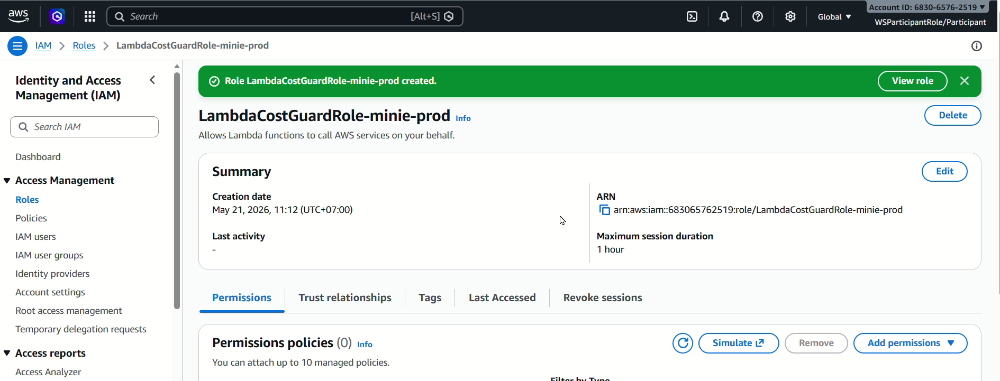

# Hướng dẫn triển khai MH-COST-A — Automated Cost Guard

Tôi sẽ hướng dẫn **chi tiết tuần tự** để xây dựng 4 component bắt buộc. Đây là hệ thống **tự động stop resource** chứ không chỉ notification.

---

## **Bước 1: Tạo IAM Role (Least-Privilege) cho Lambda**

IAM → Roles → Create role

- **Trusted entity**: AWS service → Lambda
- **Role name**: `LambdaCostGuardRole-minie-prod`

**Inline policy** (least-privilege):

```json
{
  "Version": "2012-10-17",
  "Statement": [
    {
      "Effect": "Allow",
      "Action": [
        "ec2:DescribeInstances",
        "ec2:StopInstances",
        "rds:DescribeDBInstances",
        "rds:StopDBInstance"
      ],
      "Resource": "*",
      "Condition": {
        "StringNotEquals": {
          "aws:ResourceTag/keep": "true"
        }
      }
    },
    {
      "Effect": "Allow",
      "Action": [
        "logs:CreateLogGroup",
        "logs:CreateLogStream",
        "logs:PutLogEvents"
      ],
      "Resource": "arn:aws:logs:us-east-1:*:log-group:/aws/lambda/*"
    }
  ]
}
```

**Tags** (Required): Owner, Environment, CostCenter, Application



---

## **Bước 2: Deploy Lambda Function (Component a)**

### 2.1 Tạo Lambda function

Lambda → Functions → Create function

- **Function name**: `CostGuard-Stop-Untagged-Resources`
- **Runtime**: Python 3.11 (hoặc 3.12)
- **Role**: `LambdaCostGuardRole-minie-prod` (từ bước 1)
- **Timeout**: 60 seconds

### 2.2 Mã Lambda

Dán mã dưới đây vào editor:

```python
import boto3
import json
from datetime import datetime

ec2 = boto3.client('ec2', region_name='us-east-1')
rds = boto3.client('rds', region_name='us-east-1')

def lambda_handler(event, context):
    """
    Stop EC2 & RDS instances that are:
    1. NOT tagged with keep=true
    2. Environment=dev (or any criteria you define)
    Only stop if currently running.
    """

    stopped_resources = []
    errors = []

    try:
        # ========== EC2 Instances ==========
        print("[INFO] Checking EC2 instances...")

        response = ec2.describe_instances(
            Filters=[
                {'Name': 'instance-state-name', 'Values': ['running', 'pending']}
            ]
        )

        for reservation in response.get('Reservations', []):
            for instance in reservation.get('Instances', []):
                instance_id = instance['InstanceId']
                tags = {tag['Key']: tag['Value'] for tag in instance.get('Tags', [])}

                # Check if keep=true tag exists
                if tags.get('keep') == 'true':
                    print(f"[SKIP] {instance_id} has keep=true tag")
                    continue

                # OPTIONAL: Only stop if Environment=dev
                # Uncomment if you only want to stop dev instances
                # if tags.get('Environment') != 'dev':
                #     print(f"[SKIP] {instance_id} is not Environment=dev")
                #     continue

                # Stop the instance
                try:
                    ec2.stop_instances(InstanceIds=[instance_id])
                    stopped_resources.append({
                        'type': 'EC2',
                        'id': instance_id,
                        'tags': tags,
                        'timestamp': datetime.utcnow().isoformat()
                    })
                    print(f"[STOP] EC2 instance {instance_id} stopped")
                except Exception as e:
                    errors.append(f"EC2 {instance_id}: {str(e)}")
                    print(f"[ERROR] Failed to stop {instance_id}: {str(e)}")

        # ========== RDS Instances ==========
        print("[INFO] Checking RDS instances...")

        response = rds.describe_db_instances()

        for db_instance in response.get('DBInstances', []):
            db_id = db_instance['DBInstanceIdentifier']
            status = db_instance['DBInstanceStatus']

            # Skip if already stopped
            if status not in ['available', 'creating', 'modifying']:
                print(f"[SKIP] RDS {db_id} is in status {status}")
                continue

            # Get tags
            try:
                tag_response = rds.list_tags_for_resource(
                    ResourceName=db_instance['DBInstanceArn']
                )
                tags = {tag['Key']: tag['Value'] for tag in tag_response.get('TagList', [])}
            except Exception as e:
                tags = {}
                print(f"[WARN] Could not get tags for {db_id}: {str(e)}")

            # Check if keep=true tag exists
            if tags.get('keep') == 'true':
                print(f"[SKIP] {db_id} has keep=true tag")
                continue

            # Stop the RDS instance
            try:
                rds.stop_db_instance(DBInstanceIdentifier=db_id)
                stopped_resources.append({
                    'type': 'RDS',
                    'id': db_id,
                    'tags': tags,
                    'timestamp': datetime.utcnow().isoformat()
                })
                print(f"[STOP] RDS instance {db_id} stopped")
            except Exception as e:
                errors.append(f"RDS {db_id}: {str(e)}")
                print(f"[ERROR] Failed to stop {db_id}: {str(e)}")

    except Exception as e:
        print(f"[FATAL] {str(e)}")
        errors.append(f"Fatal error: {str(e)}")

    response_body = {
        'statusCode': 200,
        'stopped_count': len(stopped_resources),
        'stopped_resources': stopped_resources,
        'errors': errors,
        'timestamp': datetime.utcnow().isoformat()
    }

    print(f"[RESULT] {json.dumps(response_body, indent=2)}")

    return response_body
```

### 2.3 Deploy

- Click **Deploy**
- Verify: Status = green ✓

**Tags** cho Lambda function: Owner, Environment, CostCenter, Application


---

## **Bước 3: Tạo EventBridge Scheduler (Component b — Daily Trigger)**

EventBridge → Schedules → Create schedule

- **Schedule name**: `CostGuard-Daily-Trigger`
- **Schedule pattern**: Recurring schedule
  - **Frequency**: Daily
  - **Time**: 13:00 (UTC) — chọn giờ phù hợp, tránh peak time
  - **Timezone**: UTC

- **Flexible time window**: Off

- **Target**:
  - **Target service**: AWS Lambda
  - **Function**: `CostGuard-Stop-Untagged-Resources`
  - **Role**: Tạo role mới hoặc dùng role có permission `lambda:InvokeFunction`

**Tags** (Required)

Click **Create schedule**

**Verify**: Schedule status = **Enabled**


---

## **Bước 4: Demo Component (c) — Demonstrated Stop Action**

Để chứng minh Lambda **thực sự** stop resource, bạn cần:

### 4.1 Tạo test EC2 instance (không có tag `keep=true`)

EC2 → Instances → Launch instances

- **Name**: `test-cost-guard-instance`
- **AMI**: Amazon Linux 2023 (free tier)
- **Instance type**: `t3.micro`
- **VPC**: `minie-prod` (hoặc default)
- **Tags** (bắt buộc):
  - Key: `Owner`, Value: `test`
  - Key: `Environment`, Value: `dev`
  - Key: `CostCenter`, Value: `testing`
  - Key: `Application`, Value: `cost-guard`
  - **LỌC**: KHÔNG thêm tag `keep=true`

Wait for instance to reach **running** state (1–2 phút)

### 4.2 Screenshot Before

- Console → EC2 → Instances
- **Screenshot 1**: Tình trạng instance `test-cost-guard-instance` = **running**
  

- Note instance ID (ví dụ: `i-0abc123def456`)

### 4.3 Trigger Lambda thủ công

Lambda → Functions → `CostGuard-Stop-Untagged-Resources` → Test

- **Test event**: Tạo event mới (payload có thể trống `{}`)
- Click **Test**
- **Check output**: Nó sẽ log "STOP EC2 instance i-0abc123def456 stopped"
  

### 4.4 Screenshot After

- Đợi 15–30 giây
- Console → EC2 → Instances
- **Screenshot 2**: Instance `test-cost-guard-instance` = **stopped**
- Note thời gian state change
  

### 4.5 CloudTrail Evidence

CloudTrail → Event history

- **Search filter**:
  - Event name: `StopInstances`
    

  - Resource name: `test-cost-guard-instance` (hoặc instance ID)
    

  - Event source: `ec2.amazonaws.com`
    

---

## **Bước 5: AWS Budgets + SNS + Lambda Chain (Component d)**

### 5.1 Tạo SNS Topic

SNS → Topics → Create topic

- **Topic name**: `CostGuard-Budget-Alert`
- **Display name**: CostGuard Budget Alert

**Tags** (Required)


Copy **Topic ARN** (sẽ dùng ở bước 5.3)

### 5.2 Tạo SNS Subscription tới Lambda

SNS → Topics → `CostGuard-Budget-Alert` → Create subscription

- **Protocol**: AWS Lambda
- **Endpoint**: `CostGuard-Stop-Untagged-Resources` (Lambda function)

Click **Create subscription**


**Important**: Bạn cần cập nhật Lambda **Resource-based policy** để cho phép SNS invoke. AWS sẽ tự động thêm khi subscription tạo.

### 5.3 Tạo AWS Budget (Daily, $150)

AWS Budgets → Budgets → Create budget

- **Budget type**: Cost
- **Name**: `Daily-Cost-Guard-150`
- **Period**: Daily
- **Budgeted amount**: $150 USD

**Alert threshold**:

- Alert when **100%** of budget is forecasted to be exceeded
- Notification preferences: **Alert me by**: chọn SNS
  - Topic: `CostGuard-Budget-Alert`

Click **Create**


**Note**: Cost data latency ~8–24h → trong 48h demo, Budgets action có thể **KHÔNG fire**. Đó là điều dự kiến.

### 5.4 Demo SNS → Lambda Chain (thủ công, không chờ Budgets fire)

SNS → Topics → `CostGuard-Budget-Alert` → Publish message

- **Subject**: `Budget Alert - Cost Threshold Exceeded`
- **Message**:

```json
{
  "detail-type": "Budget Notification",
  "detail": {
    "eventName": "BudgetThreshold",
    "budgetName": "Daily-Cost-Guard-150"
  }
}
```

Click **Publish message**

**Verify**:

- Lambda Logs (CloudWatch) → `/aws/lambda/CostGuard-Stop-Untagged-Resources`
  - Xem log entry cho SNS trigger (timestamp gần đó)
  - Log sẽ ghi: `[STOP] EC2 instance i-... stopped` hoặc `[SKIP]` nếu resource đã có tag

  
